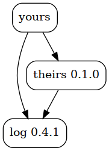
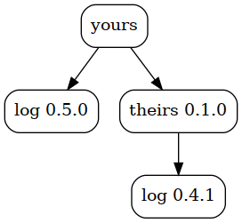
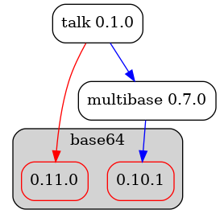
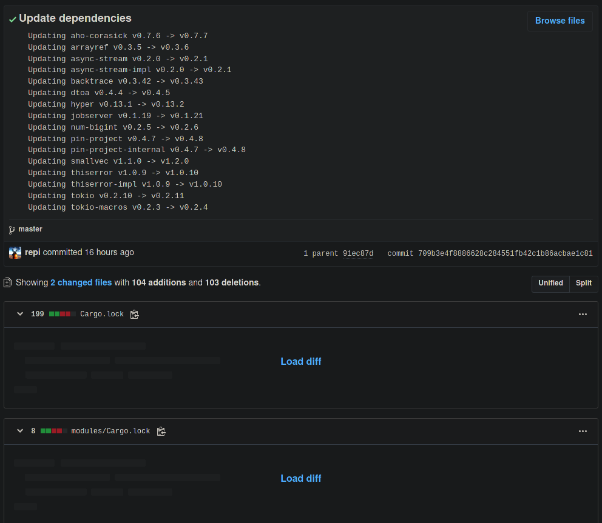

## cargo-deny

---

### Contents

- The ~Problem~ Situation
- Basic Idea of cargo-deny
- Checks
- Future

---

### About

- Game Developer for 13 years
- Edge of Reality (midd️ling) ☠️
- Vigil Games (middling) ☠️ (also THQ ☠️)
- DICE/Frostbite (huge) 🖐
- Embark Studios (small, but fierce) 🦀

---

### The Situation

_of our own making_

----

#### Gamedev (generally)

- Huge, monorepo-style codebases
- Minimal external dependencies, vendored
- Very little interaction with OSS

Note: No external dependencies, no worries? Old, stale code. Inability to drive direction. NIH.

----

#### Crate Ecosystem

- A big reason why many use Rust
- Large (35k+) and growing fast
- Huge spectrum on lots of axes

Note: The crate ecosystem is a huge reason we use Rust.

----

#### How We Work

- Use a "lot" of external dependencies (400+)
- Tend to keep all of them up to date
- Never vendor (but sometimes fork)

Note: We have been pretty good about breaking our old habits.

----

#### Update Often + Evolving Ecosystem = 😕

- Manual inspection is **tedious**
- Some things are outside Cargo's domain
- Maintain cadence over a long time

Note: Manual inspection gets old. Rust and Cargo do a lot of heavy lifting, but they don't handle certain things for good reasons.

---

### cargo-deny


----

#### Lint our crate graphs?

- Treat crate graphs like code
- Configure expectations
- Automatically verify expectations

Note: Just as with linting done by clippy, we want to configure what we actually want, then let our CI verify it continuously so that updating crates, adding new ones, changing features, etc, gives quick feedback to users and supports incremental change, rather than stagnation, or worse, chaos.

----

#### What to check?

- Licenses
- Bans
- Duplicates
- Advisories
- Sources

---

### Licenses


----

#### I am not a lawyer

Crates (usually) specify their license terms

```ini
[package]
name = "krates"
version = "0.1.0"
authors = ["Embark <opensource@embark-studios.com>"]
edition = "2018"
license = "MIT OR Apache-2.0" # SPDX license expression
# license-file = "LICENSE" # File with license text
```

Note: Cargo just exposes the metadata if the package supplies it, but that's about it, it's up to you to use that information in a way that suits you.

----

#### Still not a lawyer

- Do all the crates we use have acceptable licenses?
- How do we ensure that holds true over time?
  - New crates
  - Crates that change their licensing

----

#### Configure

- What licenses do we accept/reject?
- Copyleft? OSI Approved/FSF Free? Unlicensed?

```ini
[licenses]
unlicensed = "deny"
copyleft = "deny"
allow = [
    "Apache-2.0",
    "Apache-2.0 WITH LLVM-exception",
    "BSD-2-Clause",
    "BSD-3-Clause",
    "MIT",
]
exceptions = [
    { allow = ["Zlib"], name = "adler32" },
]
```

----

#### Evaluate


Note: We parse and evaluate the SPDX license expression, using the configuration to determine the status of each license term in the expression.

----

#### Caveats

- At the moment uses only 2 sources of input
  - `license` field
  - LICENSE(-*)? files in crate root
- Relies on crate maintainers accurately stating license
  - We have found this to be...not true for many crates using C
- Also, as you know, we're not lawyers

---

### Bans


----

#### It's OK to say no

- Not all crates will "fit" with your project
- Once a crate is removed, keep it out

----

#### Example: OpenSSL

- Often the `default` for crates doing TLS
- System dependencies are annoying (especially on Windows)
- "Better", leaner alternatives

----

#### Configure

```ini
[bans]
deny = [
    { name = "openssl" },     # we use rustls instead
    { name = "openssl-sys" }, # we use rustls instead
]
```

----

#### Evaluate

```diff
 [dependencies.reqwest]
 version = "0.10.1"
-default-features = false
 features = ["json", "rustls-tls"]
```


---

### Duplicates


----

#### Cargo's Tradeoff

- Dependency resolution is hard. As in NP-hard.
- Cargo decided to avoid the problem

----

#### Easy Case



----

#### Unsatisfiable Case



----


----

#### Pros ➕

- Fast
- Easy, particularly for new people
- Ecosystem can evolve at differing paces

Note: Since the ecosystem can evolve at different paces, this implicitly means
that with enough dependencies, duplicates are essentially inevitable.

----

#### Cons ➖

- More crates to download
- More crates to compile & link
- Larger outputs

```bash
error[E0308]: mismatched types
    ...
   = note: expected type `X` (struct `X`)
              found type `X` (struct `X`)
note: Perhaps two different versions of crate `thing` are being used?
```

----

#### cargo-deny duplicate handling

- allow/warn/deny duplicates in a project
- Give concise inclusion graph for each version
- Allow temporary skipping of certain versions

----

#### Configuration

```ini
[bans]
multiple-versions = "deny"
skip = [
    # clap uses an older version of ansi_term
    { name = "ansi_term", version = "=0.11.0" },
}
skip-tree = [
    # ignore winit as it pulls in tons of older crates
    { name = "winit", version = "=0.19" },
]
```

----


----

#### Graph Output w/ `-g`



----

#### "Real" Graph Output


----

#### Decision Time

- Do we care?
- Should we open a PR?
- Change our own versions to match?
- Remove/replace one or more crates?

----

> Duplicate detection isn't about saying duplicates are bad, it's about surfacing them so you can decide yourself

---

### Advisories


----

#### Built On Top of rustsec

- Made by people who know what they're doing
- Same core functionality used by `cargo-audit`
- Allows for **shared** knowledge

----

#### Not just vulnerabilities

- Also has advisories for ummaintained crates
- Detects crate versions that have been yanked
- More in the future?

----

#### Configuration

```ini
[advisories]
vulnerability = "deny"
unmaintained = "deny"
yanked = "deny"
ignore = [
    # spin is unmaintained, but it has a couple of heavy
    # users, particularly lazy_static, which means it
    # will take a while to ripple out into into all its users
    "RUSTSEC-2019-0031",
]
```

----


---

### Sources


----

#### Initial Motivation

[Why npm lockfiles can be a security blindspot for injecting malicious modules](https://snyk.io/blog/why-npm-lockfiles-can-be-a-security-blindspot-for-injecting-malicious-modules/)

----

#### Cargo Sources

- Local
- Registries
- Git

----



----


----

```diff
 [[package]]
 name = "smallvec"
-version = "1.1.0"
+version = "1.2.0"
-source = "registry+https://github.com/rust-lang/crates.io-index"
+source = "git+https://somewhere.com/definitely-not-mining-bitcoins?rev=c26f492"
```

----


----

#### Configuration

```ini
[sources]
unknown-registry = "deny"
unknown-git = "deny"
allow-git = [
    "https://github.com/EmbarkStudios/cpal",
    "https://github.com/EmbarkStudios/nfd-rs",
    "https://github.com/EmbarkStudios/winit",
    #"https://github.com/EmbarkStudios/shaderc-rs",
    "https://github.com/EmbarkStudios/sentry-rust",
    "https://github.com/EmbarkStudios/imgui-rs",
    "https://github.com/EmbarkStudios/keyring-rs",
    "https://github.com/EmbarkStudios/vk-mem-rs",
]
```

----


---

### Future


----

#### More Checks?

- Unused dependencies, à la [udeps](https://crates.io/crates/cargo-udeps)?
- Proc macros, build.rs, executable files...?

----

#### Hooking Resolution

[Cargo#7193](https://github.com/rust-lang/cargo/issues/7193) or similar would be great

Note: cargo-deny can only lint **after** dependency resolution, having some way of hooking into dependency resolution would mean that at least some checks (eg licenses, advisories) could be used to ensure some crates/versions can't even be resolved.
