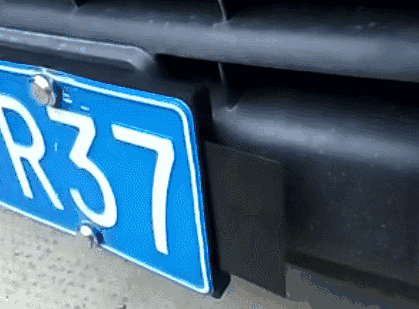
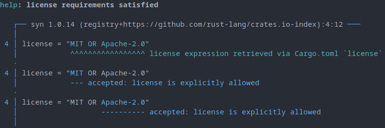

## cargo-deny

---

### Contents

- The ~Problem~ Situation
- Basic Idea of cargo-deny

---

### About

- Game Developer for 13 years
- Edge of Reality (midd️ling) ☠️
- Vigil Games (middling) ☠️ (also THQ ☠️)
- DICE/Frostbite (huge) 🖐
- Embark Studios (small, but fierce) 🦀

---

### The Situation

_of our own making_

----

#### Gamedev (generally)

- Huge, monorepo-style codebases
- Minimal external dependencies, vendored
- Very little interaction with OSS

Note: No external dependencies, no worries? Old, stale code. Inability to drive direction. NIH.

----

#### Crate Ecosystem

- A big reason why many use Rust
- Large (35k+) and growing fast
- Huge spectrum on lots of axes

Note: The crate ecosystem is a huge reason we use Rust.

----

#### How We Work

- Use a "lot" of external dependencies (400+)
- Tend to keep all of them up to date
- Never vendor (but sometimes fork)

Note: We have been pretty good about breaking our old habits.

----

#### Update Often + Evolving Ecosystem = 😕

- Manual inspection is **tedious**
- Some things are outside Cargo's domain
- Maintain cadence over a long time

Note: Manual inspection gets old. Rust and Cargo do a lot of heavy lifting, but they don't handle certain things for good reasons.

---

### cargo-deny


----

#### What to check?

- Licenses
- Bans
- Duplicates
- Advisories
- Sources

----

#### Lint our crate graphs?

- Treat crate graphs like code
- Configure expectations
- Automatically verify expectations

---

### Licenses



----

#### I am not a lawyer

Crates (usually) specify their license terms

```ini
[package]
name = "krates"
version = "0.1.0"
authors = ["Embark <opensource@embark-studios.com>"]
edition = "2018"
license = "MIT OR Apache-2.0" # SPDX license expression
# license-file = "LICENSE" # File with license text
```

Note: Cargo just exposes the metadata if the package supplies it, but that's about it

----

#### Still not a lawyer

- Do all the crates we use have acceptable licenses?
- How do we ensure that holds true over time?
  - New crates
  - Crates that change their licensing

----

#### Configure

- What licenses do we accept/reject?
- Copyleft? OSI Approved/FSF Free? Unlicensed?

```ini
[licenses]
unlicensed = "deny"
copyleft = "deny"
allow = [
    "Apache-2.0",
    "Apache-2.0 WITH LLVM-exception",
    "BSD-2-Clause",
    "BSD-3-Clause",
    "MIT",
]
exceptions = [
    { allow = ["Zlib"], name = "adler32" },
]
```

----

#### Evaluate



Note: We parse and evaluate the SPDX license expression, using the configuration to determine the status of each license term in the expression.

---

### Bans


----

#### It's OK to say no

- Not all crates will "fit" with your project
- Once a crate is removed, keep it out

----

#### Example: OpenSSL

- Often the `default` for crates doing TLS
- System dependencies are annoying (especially on Windows)
- "Better", leaner alternatives

----

#### Configure

```ini
[bans]
deny = [
    { name = "openssl" },     # we use rustls instead
    { name = "openssl-sys" }, # we use rustls instead
]
```

----

#### Evaluate

```diff
 [dependencies.reqwest]
 version = "0.10.1"
-default-features = false
 features = ["json", "rustls-tls"]
```


---

### Duplicates

