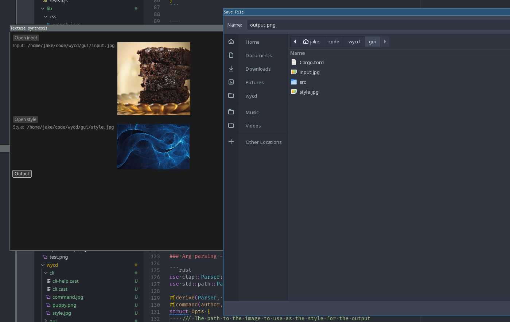

<!-- markdownlint-disable MD033 MD035 -->

## Rust - What you can do

----

### Contents

- Running Theme
- CLI
- GUI
- ~Mobile~
- Server
- ~Edge compute~
- Local WASM
- Summary

----

### About

- Game Developer for 15+ years
- Edge of Reality
- Vigil Games
- DICE/Frostbite
- Embark Studios 🦀

---

## Running Theme

`🎨 texture-synthesis`


----

```mermaid
%%{init: {'theme': 'base', 'themeVariables': { 'primaryColor': '#7a9f60', 'primaryTextColor': '#ffffff' }}}%%
graph LR;
   i1[Input image 1]
   i2[Input image 2]
   i3[Input image n]
   i4[Configuration]
   math[Magic Maths]
   output[Output image]
   i1 --> math;
   i2 --> math;
   i3 --> math;
   i4 --> math;
   math --> output;
```

----

- Rust project created by former colleagues
- <https://github.com/EmbarkStudios/texture-synthesis>
- Lots of different uses, we'll just be using style transfer
- Youtube talk by the most excellent Anastasia <https://youtu.be/fMbK7PYQux4?t=460>

----

```rust
use texture_synthesis as ts;

fn main() -> Result<(), ts::Error> {
    let session = ts::Session::builder()
        // load example which will serve as our style
        .add_examples(&[&"style-image-goes-here"])
        // load target style will be applied to
        .load_target_guide(&"image-to-stylize")
        .guide_alpha(0.8)
        .build()?;

    let generated = session.run(None);
    generated.save("output.image")
}
```

---

## CLI


----

### Input


----

### Run

<div class="asciicast" data-cast="cli/cli.cast" data-speed="0.5"></div>

----

### Output


----

[clap](https://crates.io/crates/clap)

```rust
use clap::Parser;
use std::path::PathBuf;

#[derive(Parser, Debug)]
#[command(author, version, about, long_about = None)]
struct Opts {
    /// The path to the image to use as the style for the output
    #[arg(short, long)]
    style: PathBuf,
    /// The path to the image we want to transfer the style onto
    #[arg(short, long)]
    input: PathBuf,
    /// The path where we want to save the generated output
    output: PathBuf,
}

fn main() -> anyhow::Result<()> {
    let opts = Opts::parse();
}
```

----

`--help`

<div class="asciicast" data-cast="cli/cli-help.cast" data-autoplay="true" data-rows="12"></div>

----

Progress bars via [indicatif](https://crates.io/crates/indicatif)


----

### Ecosystem

- Rust has an extremely strong ecosystem around CLI applications
  - Argument parsing
  - TTY output (colors etc)
  - Logging/tracing
- [Official Rust CLI page](https://www.rust-lang.org/what/cli)
- [Writing your first CLI app](https://rust-cli.github.io/book/index.html)

----

### Cool Projects

- [`exa`](https://github.com/ogham/exa) - `ls` replacment
- [`topgrade`](https://github.com/r-darwish/topgrade) - upgrades all the things (package manager, cargo binaries, zsh, ...)
- [`fd`](https://github.com/sharkdp/fd) - `find` replacement
- [`ripgrep`](https://github.com/BurntSushi/ripgrep) - `grep` replacement
- [`dust`](https://github.com/bootandy/dust) - `du` replacement
- [uutils/coreutils](https://github.com/uutils/coreutils) - Cross platform Rust rewrite of GNU coreutils
- Lots more see <https://github.com/matu3ba/awesome-cli-rust>

---

## GUI


----

### Input


----

### Run



----

### Output


----

[egui](https://crates.io/crates/egui)

- Essentially a Rust rewrite of [dearimgui](https://github.com/ocornut/imgui)
- Immediate mode, suits Rust extremely well
- Highly portable
- Maintained by another former colleague

----

Native file dialogs via [rfd](https://crates.io/crates/rfd)

Wrapper around Windows, Linux and BSD (GTK / XDG), MacOS APIs

----

### Ecosystem

- Rendering
- Fonts
- Bindings (GTK, Win32, Qt, imgui etc)
- Higher level frameworks

----

<https://www.areweguiyet.com> = 😅

Honestly speaking, GUIs are probably the biggest gap in the general Rust ecosystem, depending on your intended use case

---

## Server


----

### Input


----

### Server Run

<div class="asciicast" data-cast="server/server.cast" data-rows="12" data-speed="4"></div>

----

### Curl Run

<div class="asciicast" data-cast="server/curl.cast" data-rows="12" data-speed="4"></div>

----

### Output


----

[axum](https://crates.io/crates/axum)

- High level HTTP library
- Maintained by a current! colleague

```rust
fn main() {
    let app = Router::new()
        .route("/stylize", routing::post(stylize))
        .layer(Extension(Arc::new(State { style })));
}

async fn stylize(
    Extension(state): Extension<Arc<State>>,
    body: Bytes
) -> impl IntoResponse {
    // ...
}
```

----

### Ecosystem

- Extremely strong both client and server side
- [`rustls`](https://github.com/rustls/rustls) for TLS, get rid of old baggage
- `async` has gotten better, but maybe not _as_ nice as in other languages
- `x86_64-unknown-linux-musl` for easy deployment

---

## Wasm


----

### Input


----

### Run


----

### Output


----

### Ecosystem

- I would argue Rust is the best language for targeting `wasm`
- rustc/cargo can easily target `wasm32-unknown-unknown` or `wasm32-wasi`
- Multiple wasm runtimes/interpreters are implemented in Rust
- [Documentation](https://rustwasm.github.io/docs/book/)

---

## Summary

- Handles lots of common use cases very well
- Ecosystem continues to improve at a rapid pace
- But lots of gaps to fill!
